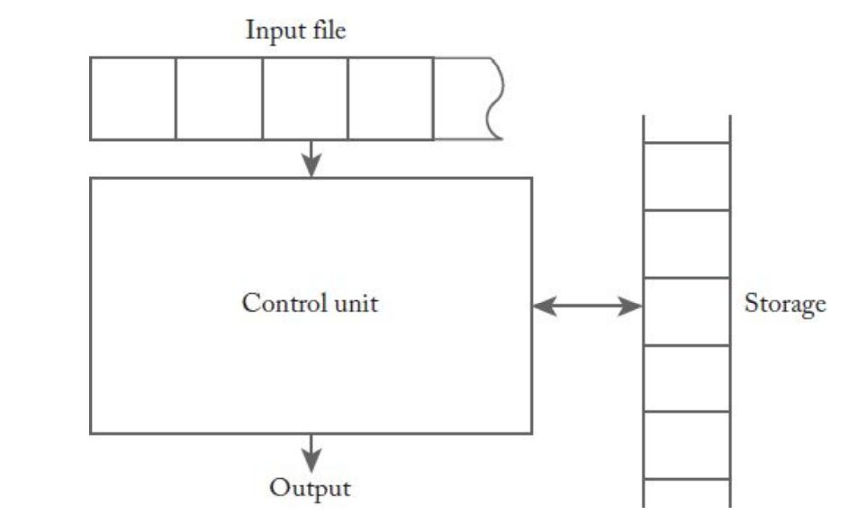

  <a href="https://www.linkedin.com/in/aminkhani-ai/" targert="_blacnk">
    
  
    
  
  

 

  <h1 align="center">Formal Languages and Automata Theory (FLAT) Tutorial</h1>
  
  
 
     
   <a href="https://github.com/aminkhani/Automata-Theory/issues/new?assignees=&labels=bug&template=bug_report.yml&title=%5BBUG%5D%3A+">🐛Report Bug</a>
   .
   <a href="https://github.com/aminkhani/Automata-Theory/issues/new?assignees=&labels=question&template=question.yml&title=%5BQUESTION%5D%3A+">❓Ask Question</a>
   .
  <a href="https://github.com/aminkhani/Automata-Theory/issues/new?assignees=&labels=like&template=like.yml&title=%5BLIKE%5D%3A+">👍Like the repo</a>
  .
  <a href="https://github.com/aminkhani/Automata-Theory/issues/new?assignees=&labels=unlike&template=unlike.yml&title=%5BUNLIKE%5D%3A+">👎Dislike the repo</a>
  

  

  

> **Note**
>
> 📣 You can help to improve this repo, by giving me a **⭐star⭐** and **❤️following me❤️**
> 
> **Warning**
> 
> It is better to use the web browser to view the math notation in this repository.
 

<h1 id="top">Contents</h1>
<h3>Prerequisite</h3>
<ul>
    <li><a href="#what_is_theory">Theory Definition</a></li>
    <li><a href="#scientific_theory">Scientific Theory Definition</a></li>
    <li><a href="#TCS">TCS</a>
        <ul>
            <li><a href="#algorithm">Algorithms</a></li>
            <li><a href="#ds">Data Structures</a></li>
            <li><a href="#complexity">Computational Complexity</a></li>
            <li><a href="#parallel">Parallel & Distributed Computation</a></li>
            <li><a href="#probab">Probabilistic Computation</a></li>
            <li><a href="#quantum">Quantum Computation</a></li>
            <li><a href="#auto_theory">Automata Theory</a></li>
            <li><a href="#info_theory">Information Theory</a></li>
            <li><a href="#crypto">Cryptography</a></li>
            <li><a href="#prog_seman">Program Semantics & Verification</a></li>
            <li><a href="#game_theory">Algorithmic Game Theory</a></li>
            <li><a href="#ML">Machine Learning</a></li>
            <li><a href="#biology">Computational Biology</a></li>
            <li><a href="#economi">Computational Economics</a></li>
            <li><a href="#geometry">Computational Geometry</a></li>
            <li><a href="#number">Computational Number Theory</a></li>
            <li><a href="#algebra">Algebra</a></li>
        </ul>
    </li>
</ul>
<h3 id=topp>The Tutorial</h3>
<ul>
  <li><a href="#formal_languages">Mathematical Preliminaries And Notation</a>
    <ul>
      <li><a href="#set">Sets</a>
        <ul>
          <li><a href="#union">Union</a></li>
          <li><a href="#intersection">Intersection</a></li>
          <li><a href="#difference">Difference</a></li>
          <li><a href="#complementation">Complementation</a></li>
          <li><a href="#empty">Empty Set</a></li>
          <li><a href="#deMorgan">DeMorgan’s laws</a></li>
          <li><a href="#subset">Subset</a></li>
          <li><a href="#proper">Proper Subset</a></li>
          <li><a href="#disjoint">Disjoint</a></li>
          <li><a href="#finite">Finite & Infinite</a></li>
          <li><a href="#powerset">Powerset</a></li>
          <li><a href="#cartesian">Cartesian Product</a></li>
          <li><a href="#partition">Partition</a></li>
        </ul>
      </li>
      <li><a href="#function">Functions and Relations</a>
      </li>
      <li><a href="#graphs">Graphs</a>
        <ul>
          <li><a href="#edge">Vertices & Edges</a></li>
          <li><a href="#walk">Walk</a></li>
          <li><a href="#path">Path & Simple Path</a></li>
          <li><a href="#cycle">Cycle</a></li>
        </ul>
      </li>
      <li><a href="#tree">Trees</a>
        <ul>
          <li><a href="#child">Parent & Child</a></li>
          <li><a href="#lvl">Level</a></li>
          <li><a href="#height">Height</a></li>
        </ul>
      </li>
      <li><a href="#proof">Proof Techniques</a>
        <ul>
          <li><a href="#proof1">Proof By Induction</a></li>
          <li><a href="#proof2">Proof By Contradiction</a></li>
        </ul>
      </li>
      <li><a href="#languages">Languages</a></li>
      <li><a href="#grammars">Grammars</a></li>
      <li><a href="#automata">Automata</a></li>
    </ul>
  </li>
</ul>

<h1 id="what_is_theory">What Is a Theory?</h1>

- In everyday use, the word **theory** often means an **untested hunch**, or a **guess** without **supporting evidence**. But for **scientists**, a theory has nearly the opposite meaning.
 

- A **theory** is a well-substantiated explanation of an aspect of the natural world that can incorporate **laws**, **hypotheses** and **facts**.
 

- **Theory** is a rational type of **abstract thinking** about a **phenomenon**, or the **results of such thinking**. The process of contemplative and rational thinking is often associated with such processes as observational study or research.

- The **theory of gravitation**, for instance, explains why apples fall from trees and astronauts float in space.
 

- In **modern science**, the term **theory** refers to **scientific theories**.

<h1 id="scientific_theory">What Is a Scientific Theory?</h1>

- **Scientific theory** is an explanation of an aspect of the natural world and universe that has been **repeatedly tested** and **corroborated** in accordance with the **scientific method**, using accepted protocols of **observation**, **measurement**, and **evaluation** of results.
 

- A **scientific theory** differs from a **scientific fact** or **scientific law**, in that a **theory** explains **why** or **how**: a **fact** is a **simple**, **basic observation**, whereas a **law** is a **statement (often a mathematical equation)** about a relationship between **facts**.
 

- For example, **Newton’s Law of Gravity** is a **mathematical equation** that can be used to predict the attraction between bodies, but it is **not a theory** to explain **how gravity works**.
 

- **[Stephen Jay Gould wrote that](https://en.wikipedia.org/wiki/Stephen_Jay_Gould)** "...**facts** and **heories** are **different** things, not rungs in a hierarchy of increasing certainty. **Facts** are the world's data. **Theories** are structures of ideas that explain and interpret facts.

<h1 id="TCS">Theoretical Computer Science (TCS)</h1>

- **Theoretical computer science (TCS)** is a subset of **general computer science** and **mathematics** that focuses on **mathematical aspects of computer science** such as the **theory of computation**, **lambda calculus**, and **type theory**.

## TCS covers a wide variety of topics including: 

- ### [Algorithms](https://en.wikipedia.org/wiki/Algorithm)
  - An **algorithm** is a **step-by-step procedure for calculations**. **Algorithms** are used for **calculation**, **data processing**, and **automated reasoning**.
   

  - An **algorithm** is an effective method expressed as a finite list of well-defined instructions for calculating a function. Starting from an initial state and initial input (perhaps empty).

- ### [Data Structures](https://en.wikipedia.org/wiki/Data_structure)
  - **Data structure** is a **data organization**, **management**, and **storage format** that is usually chosen for efficient access to data.
   

  - More precisely, a **data structure** is a **collection of data values**, the **relationships** among them, and the **functions or operations** that can be applied to the data

- ### [Computational Complexity Theory](https://en.wikipedia.org/wiki/Computational_complexity_theory)
  - Focuses on **classifying computational problems** according to their **resource usage**, and **relating** these classes to each other.
   

  - A **computational problem** is a **task** solved by a **computer**. A **computation problem** is solvable by **mechanical application of mathematical steps**, such as an **algorithm**.

- ### [Parallel](https://en.wikipedia.org/wiki/Parallel_computing) and [Distributed Computing](https://en.wikipedia.org/wiki/Distributed_computing)
  - **Parallel computing** is a **type of computation** in which many **calculations or processes** are carried out **simultaneously**.
   

  - **Large problems** can often be divided into smaller ones, which can then be solved at the same time.

- ### [Probabilistic Computation](https://en.wikipedia.org/wiki/Probabilistic_computation)
  

- ### [Quantum Computation](https://en.wikipedia.org/wiki/Quantum_computation)

- ### [Automata Theory]()

- ### [Information Theory](https://en.wikipedia.org/wiki/Information_theory)

- ### [Cryptography](https://en.wikipedia.org/wiki/Cryptography)

- ### [Program Semantics](https://en.wikipedia.org/wiki/Program_semantics) and [Verification](https://en.wikipedia.org/wiki/Formal_methods)

- ### [Algorithmic Game Theory](https://en.wikipedia.org/wiki/Algorithmic_game_theory)

- ### [Machine Learning](https://en.wikipedia.org/wiki/Machine_learning)
  

- ### [Computational Biology](https://en.wikipedia.org/wiki/Computational_biology)
    

- ### [Computational Economics](https://en.wikipedia.org/wiki/Computational_economics)
    

- ### [Computational Geometry](https://en.wikipedia.org/wiki/Computational_geometry)
    

- ### [Computational Number Theory](https://en.wikipedia.org/wiki/Computational_number_theory)

- ### [Algebra](https://en.wikipedia.org/wiki/Algebra)
  

<h1 id="formal_languages">Mathematical Preliminaries And Notation</h1>

- # Sets

  - **Set** is a **collection of elements**, **without any structure** other than membership.
     

  - To indicate that **$x$** is an **element** of the **set** **$S$**, we write **$x ∈ S$**.
   

  - The statement that **$x$** is **not in** **$S$** is written **$x ∉ S$**.
   

  - The **set of integers 0, 1, 2** is shown as: 
    - $S =\\{0, 1, 2\\}$
   

  - **$S$** is the **set of** all **$i$**, such that **$i$** is **greater than zero**:
    - $S = \\{i : i > 0\\}$

- # Set Terms

- ## Union ( $\bigcup$ )
  - $S_1 \bigcup S_2 = \\{x : x ∈ S_1 \mid\mid x ∈ S_2\\}$

- ## Intersection ( $\bigcap$ )
  - $S_1 \bigcap S_2 = \\{x : x ∈ S_1 \And x ∈ S_2\\}$

- ## Difference ( $-$ )
  - $S_1 − S_2 = \\{x : x ∈ S_1 \And x ∉ S_2\\}$

- ## Complementation ( $\overline{S}$ )
  - The **complement** of a **set $S$**, is **$\overline{S}$** that consists of **all elements not in $S$**. 
  - **Universal set ( $U$ )**: **all possible elements**.
   

  - $\overline{S} = \\{x : x ∈ U, x ∉ S\\}$

- ## Emtpy Set ( $\varnothing$ )
  - The **set** with **no elements**, called the **empty set** or the **null set**.
   

  - $S \bigcup \varnothing = S − \varnothing = S$
   

  - $S \bigcap \varnothing = \varnothing$
   

  - $\overline{\varnothing} = U$ 

- ## DeMorgan’s laws
  - $\overline{S_1 \bigcup S_2} = \overline{S_1} \bigcap \overline{S_2}$
   

  - $\overline{S_1 \bigcap S_2} = \overline{S_1} \bigcup \overline{S_2}$ 

- ## Subset ( $\subseteq$ )
  - A **set** **$S_1$** is said to be a **subset** of **$S$** if **every element of** **$S_1$** is **also an element of** **$S$**:
    - $S_1 \subseteq S$

- ## Proper Subset ( $\subset$ )
  - If **$S_1 \subseteq S$**, but **$S$** contains an **element not in** **$S_1$**, we say that **$S_1$** is a **proper subset** of **$S$**:
    - $S_1 \subset S$ 

- ## Disjoint ( $\cap$ )
  - If **$S_1$** and **$S_2$** have **no common element**, that is, **$S_1 \bigcap S_2 = \varnothing$**, then the **sets** are said to be **disjoint**.

- ## Finite & Infinite Set
  - A **set** is **finite** if it has **a finite number of elements**. The **size** of a **finite set** is the **number of elements** in it:
    - $|S|$

   

  - A **set** is **infinite** if it has **an infinite number of elements**.

- ## Powerset ( $2^{|S|}$ )
  - The **set** of **all subsets of a set** **$S$**.
  - For example: $S = \\{a, b\\}$
  - $2^{|S|} =  \\{\varnothing, \\{a\\}, \\{b\\}, \\{a, b\\}, \\{a, b\\}\\}$
  - Number of subset: $|S| = 2 \longrightarrow 2^{2} = 2$

- ## Cartesian Product ( $\times$ )
  - The **Cartesian product** of **two sets**, which **itself** is a **set of ordered pairs**.
  - $S = S_1 \times S_2 = \\{(x, y) : x ∈ S_1, y ∈ S_2\\}$
  - For example: Let $S_1 = \\{2, 4\\}$ and $S_2 = \\{2, 3\\}$
  - $S_1 \times S_2 = \\{(2, 2), (2, 3), (4, 2), (4, 3)\\}$
    

  > **Note** that the order in which the elements of a pair are written matters.

  

- ## Partition
  - A **set** can be divided by separating it into a number of **subsets**. Suppose that **$S_1, S_2, …, S_n$** are **subsets** of a given **set** **$S$** and that the following holds:
    - The **subsets** **$S_1, S_2, …, S_n$** are **mutually disjoint**:
      - $S_1 \bigcap S_2 \bigcap … \bigcap S_n = \varnothing$ 
     

    - $S_1 \bigcup S_2 \bigcup … \bigcup S_n = S$
     

    - None of the **$S_i$** is **empty**:
        - $S_i \neq \varnothing$

<h2 id="function">Functions and Relations</h2>

- A **function** is a **rule** that assigns to elements of **one set** a **unique element of another set**. If **$f$** denotes a **function**, then the **first set** is called the **domain** of **$f$**, and the **second set** is its **range**.
  - $f: S_1 \rightarrow S_2$
 

- If the **domain** of **$f$** is **all of** **$S_1$**, we say that **$f$** is a **total function** on **$S_1$**; **otherwise** **$f$** is said to be a **partial function**.

<h2 id="graphs">Graphs</h2>

- ### Vertices & Edges
- A **graph** is a construct consisting of **two finite sets**:
  - **Vertices**: the **set** **$V = \\{v_1, v_2, …, v_n\\}$**.
  - **Edges**: the **set** **$E = \\{e_1, e_2, …, e_m\\}$**.
  - Each **edge** is a **pair** of **vertices** from **V**
    - $e_i = (v_j, v_k)$
 

  - We say that the **edge** **$e_i$** is an **outgoing edge** for **$v_j$** and an **incoming edge** for **$v_k$**. Such a construct is actually a **directed graph (digraph)**.

- ### Walk
  - A **sequence of edges** **$(v_i, v_j)$**, **$(v_j, v_k)$**, …, **$(v_m, v_n)$**, from **$v_i$** to **$v_n$**. 
   

  - The **length of a walk** is the **total number of edges**.

- ### Path & Simple Path
  - A **walk** in which **no edge is repeated**.
  - A **path** is **simple** if **no vertex is repeated**.

- ### Cycle
  - A **walk** from **$v_i$** to **itself** with **no repeated** **edges** is called a **cycle with base** **$v_i$**.
     

  - If **no vertices** other than the **base** are **repeated** in a **cycle**, then it is said to be **simple**.
   

  - **Loop**: An **edge** from a **vertex** to **itself**. 

<h2 id="tree">Trees</h2>

- **Trees** are a **particular type of graph**.
 

- **Tree** is a **directed graph** that has **no cycles** and that has **one distinct vertex**, called the **root**, such that there is **exactly one path** from the **root** to **every other vertex**. 
 

- **Root** has no **incoming edges** and that there are **some vertices without outgoing edges**. These are **called** the **leaves of the tree**.

- ### Parent & Child
  - If there is an **edge** from **$v_i$** to **$v_j$** , then **$v_i$** is said to be the **parent** of **$v_j$** , and **$v_j$** the **child** of **$v_i$**.

- ### Level
  - The **level** of a **vertex** is the **length of the path** from the **root** to the **vertex**.

- ### Height
  - The **height** of a **tree** is the **maximum level** of any **vertex** in the **tree**.
 

 

<h2 id="proof">Proof Techniques</h2>

- ### Proof By Induction
  - **Induction** is a **technique** by which the **truth of a number of statements** can be inferred from the **truth of a few specific instances**.
   

  - **Basis**: 
   

  - **Inductive Step**: 
    

  - **Inductive assumption**:

- ### Proof By Contradiction
  - **Proof by contradiction** is another **powerful technique** that often **works** when **everything else fails**.
   

  - Suppose we want to **prove** that some **statement **$P$** is true**. We then **assume**, for the moment, that **$P$** is **false** and see where that assumption leads us. If we **arrive at a conclusion** that **we know is incorrect**, we can **lay** the blame on the starting assumption and conclude that **$P$** must be **true**.

<h1 id="languages">Languages</h1>

- **Dictionaries** define the term **informally** as a **system suitable** for the **expression of certain ideas**, **facts**, or **concepts**, **including a set of symbols and rules** for their manipulation.
 

- We start with a **finite**, **nonempty set** **$Σ$** of **symbols**, called the **alphabet**. From the individual symbols we construct **strings**, which are **finite sequences of symbols from the alphabet**.
    

  - For example, if the **alphabet** **$Σ = \\{a, b\\}$**, then **abab** and **aaabbba** are **strings** on **$Σ$**.
 

- We will use **lowercase letters** **a, b, c, …** for **elements** of **$Σ$** and **u, v, w, …** for **string names**. 
  - **$w = abaaa$**, **string named** **$w$** has the **specific value** **$abaaa$**.
 

- The **concatenation** of **two strings** **$w$** and **$v$** is the **string** obtained by **appending the symbols** of **$v$** to the **right end** of **$w$**.
   

  - **$w = a_1a_2 ⋯a_n$**, **$v = b_1b_2 ⋯b_m$**
  - The **concatenation** of **$w$** and **$v$**, denoted by **$wv$**:
    - **$wv = a_1a_2 ⋯a_nb_1b_2 ⋯b_m$**
   

- The **reverse** of a **string** is obtained by **writing** the **symbols in reverse order**; if **$w$** is a **string** as shown above, then its **reverse** is **$w^R$**.
  - **$w = a_1a_2⋯a_n$**, **$w^R = a_n⋯a_2a_1$**
   

- The **length of a string** **$w$**, denoted by **$|w|$**, is the **number of symbols** in the **string**. 
- The **empty string**, which is a **string** with **no symbols** at all. It will be denoted by **$λ$**.
  - **$|λ| = 0$**, **$λw = wλ = w$**
 

- Any **string** of **consecutive symbols** in some **$w$** is said to be a **substring** of **$w$**.
  - **$w = vu$**
  - The **substrings** **$v$** and **$u$** are said to be a **prefix** and a **suffix** of **$w$**.
   

  - For example, if **$w = abbab$**, then **$\\{λ, a, ab, abb, abba, abbab\\}$** is the **set** of all **prefixes** of **$w$**, while **$bab$**, **$ab$**, **$b$** are some of its **suffixes**.
 

- If **$w$** is a **string**, then **$w^n$** stands for the **string obtained by repeating** **$w$**, **$n$** times.
  - **$w^3 = w.w.w$**, **$w^0 = λ$**
 

- If **$Σ$** is an **alphabet**, then we use **$Σ^*$** to denote the **set of strings** obtained by **concatenating** **zero or more symbols from** **$Σ$**. The **set** **$Σ^*$** always **contains** **$λ$**. To **exclude the empty string**:
  - **$Σ^+ = Σ^∗ − \\{λ\\}$**
  - While **$Σ$** is **finite by assumption**, **$Σ^*$** and **$Σ^+$** are **always infinite** since there is **no limit on the length** of the **strings** in these sets.
 

- A **language** is defined very generally as a **subset** of **$Σ^*$**. A **string** in a **language** **$L$** will be **called a sentence** of **$L$**.
 

- #### Example
  - Let **$Σ = \\{a, b\\}$**. Then **$Σ^∗ = \\{λ, a, b, aa, ab, aab, ...\\}$**. The **set** **$\\{a, aa, aab\\}$** is a **language** on **$Σ$**. Because it has a **finite number of sentences**, we call it a **finite language**. 
   

  - The **set** **$L = \\{a^nb^n: n ≥ 0\\}$** is also a **language** on **$Σ$**. The **strings** **$aabb$** and **$aaaabbbb$** are in the **language** **$L$**, but the **string** **$abb$** is **not in** **$L$**. This **language is infinite**. **Most interesting languages are infinite**.
 

- Since **languages** are **sets**, the **union**, **intersection**, and **difference** of two languages are immediately defined.
 

- The **complement** of a **language** is defined with **respect** to **$Σ^*$**; that is, the **complement** of **$L$** is: 
  - **$L = Σ^∗ − L$**
 

- The **reverse** of a **language** is the **set of all string reversals**, that is:
  - **$L^R = \\{w^R : w ∈ L\\}$**
 

- The **concatenation** of two languages **$L_1$** and **$L_2$** is the **set** of all strings obtained by **concatenating** any element of **$L_1$** with any element of **$L_2$**; specifically:
  - **$L_1L_2 = \\{xy : x ∈ L_1, y ∈ L_2\\}$**
 

- We define **$L^n$** as **$L$** **concatenated** with itself **$n$** times: 
  - **$L^0 = \lambda$**
  - **$L^1 = L$**
 

- Define the **star-closure** of a **language** as:
  - **$L^∗ = L^0 \bigcup L^1 \bigcup L^2 ⋯$**
 

- Define the **positive closure** of a **language** as:
  - **$L^+ = L^1 \bigcup L^2 ⋯$**

<h1 id="grammars">Grammars</h1>

- A **grammar** **$G$** is defined as a **quadruple**:
  - **$G = (V , T, S, P)$**
   

  - **$V$** is a **finite set of objects** called **variables**.
  - **$T$** is a **finite set of objects** called **terminal symbols**.
  - **$S ∈ V$** is a **special symbol** called the **start variable**
  - **$P$** is a **finite set of productions**.
  - **Assumed** that the **sets** **$V$** and **$T$** are **nonempty** and **disjoint**.
   

- The **production rules** are the **heart of a grammar**; they **specify** **how the grammar transforms one string into another**, and through this they **define** a **language associated with the grammar**. 
 

- We will **assume** that **all production rules** are of the form:
  - **$x \rightarrow y$**
  - **$x$** is an **element of** **$(V ∪ T)^+$**  
  - **$y$** is **in** **$(V ∪ T)^*$**
 

- The **productions** are applied in the following manner:
  - We have a **string**: 
    - **$w = uxv$**
  - The **production** **$x → y$** is applicable to this **string**.
  - The new **string** is:
    - **$z = uyv$**
  - We can write this as:
    - **$w \Rightarrow z$** 
    - We say that **$w$** **derives** **$z$** or that **$z$** is **derived** from **$w$**.
   

- By applying the **production rules** in a **different order**, a **given grammar** can normally **generate many strings**. The **set** of all **such terminal strings** is the **language defined** or **generated by the grammar**.
 
 
- Let **$G = (V, T, S, P)$** be a **grammar**. 
  - **$L(G) = \\{w ∈ T^∗: S \dot{\Rightarrow} w\\}$**
  - Is the **language** **generated by** **$G$**.
 

- If **$w ∈ L(G)$**:
  - **$S ⇒ w1 ⇒ w2 ⇒ ⋯ ⇒ wn ⇒ w$**
  - The **sequence** is a **derivation** of the **sentence** **$w$**.
  - The **strings** **$S, w_1, w_2, …, w_n$**, which **contain variables as well as terminals**, are called **sentential forms** of the **derivation**.
 

- #### Example
- The **grammer** is: **$G = (\\{S\\}, \\{a, b\\}, S, P)$**
- **$P$** given by: **$S → aSb$**, **$S → λ$**.
- Then: **$S ⇒ aSb ⇒ aaSbb ⇒ aabb$**
- We can write: **$S \dot{\Rightarrow} aabb$**
- The **string** **$aabb$** is a **sentence** in the **language generated by** **$G$**, while **$aaSbb$** is a **sentential form**.
 

- A **grammar** **$G$** **completely defines** **$L(G)$**, but it may not be easy to get a very explicit description of the language from the grammar. Here, however, the answer is fairly clear. It is not hard to conjecture that: 
  - **$L(G) = \\{a^nb^n: n ≥ 0\\}$**
 

- Normally, a given **language** has **many grammars** that generate it. Even though these grammars are different, they are **equivalent** in some sense. 
- We say that **two grammars** **$G_1$** and **$G_2$** are **equivalent** if they **generate the same language**:
  - **$L(G_1) = L(G_2)$**

<h1 id="automata">Automata</h1>

- An **automaton** is an **abstract model of a digital computer**. As such, **every automaton** includes **some essential features**. It has a **mechanism for reading input**. It will be **assumed** that the **input is a string over a given alphabet**, **written on an input file**, which the **automaton** can **read but not change**.
 

- The **input file** is **divided into cells**, each of which can **hold one symbol**. The **input mechanism** can **read the input file** from **left to right**, **one symbol at a time**. The **input mechanism** can also **detect** the **end of the input string** (by sensing an **end-of-file condition**).
 

- The **automaton** can **produce output of some form**. It may have a **temporary storage device**, **consisting of an unlimited number of cells**, each **capable of holding a single symbol from an alphabet** (not necessarily the same one as the input alphabet).
 

- The **automaton** can **read and change** the **contents of the storage cells**. **Finally**, the **automaton has a control unit**, which can be in any one of a **finite number of internal states**, and which can **change state** in some defined manner.
 

 

- An **automaton** is **assumed** to **operate** in a **discrete time frame**. **At any given time**, the **control unit** is in some **internal state**, and the **input mechanism** is **scanning a particular symbol on the input file**. The **internal state of the control unit** at the **next time step** is determined by the **next-state** or **transition function**.
 

- The **transition function** gives the **next state** in **terms of the current state**, the **current input symbol**, and the **information currently** in the **temporary storage**. During the **transition from one time interval to the next**, **output** may be **produced** or the **information in the temporary storage changed**.
 

- The **term configuration** will be used to refer to a **particular state of the control unit**, **input file**, and **temporary storage**. The **transition of the automaton** from **one configuration to the next** will be called a **move**.
 

